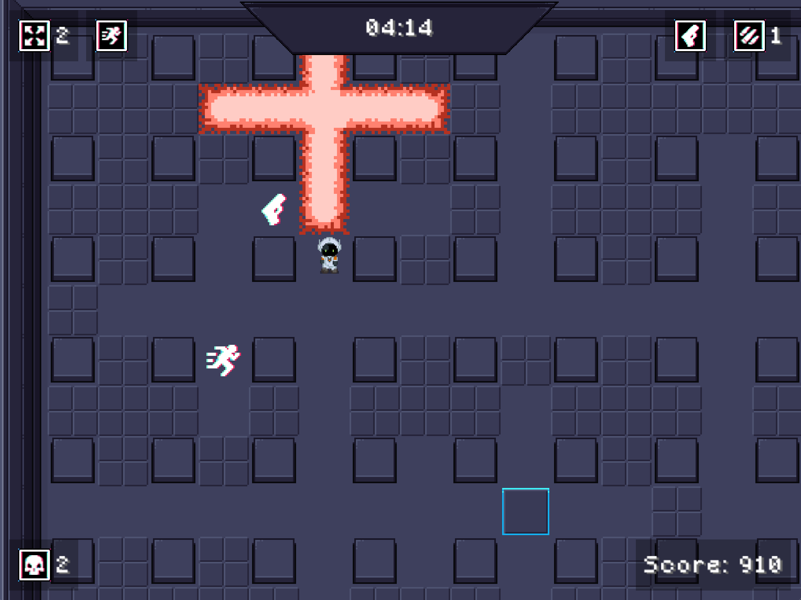

# BomberQuest

A Java/LibGDX game inspired by the classic **Bomberman**. Navigate through tiled maps, place bombs to destroy obstacles (and enemies), collect power-ups, and attempt to reach the exit before time runs out. An **A\* pathfinding** algorithm gives enemies intelligent movement. Enjoy custom music, custom map loading, and robust settings (including persistent key bindings).




---

## Table of Contents

1. [Game Overview](#game-overview)
2. [Features](#features)
    1. [Menus & Screens](#menus--screens)
    2. [Settings & Key Bindings](#settings--key-bindings)
    3. [Map System](#map-system)
    4. [Enemy AI (A* Pathfinding)](#enemy-ai-a-pathfinding)
3. [Bonus Features](#bonus-features)
4. [Project Structure](#project-structure)
    1. [Core Classes](#core-classes)
    2. [Screens](#screens)
    3. [Game Objects](#game-objects)
    4. [Map Parsing & Pathfinding](#map-parsing--pathfinding)
5. [Controls](#controls)

---

## Game Overview

**BomberQuest** is a 2D tile-based game in which the player:
- Explores a grid-based map.
- Places bombs to destroy destructible walls and enemies.
- Collects power-ups that increase the number of bombs they can place and the bombs’ blast radius.
- Attempts to reach the exit to complete the level (the exit becomes available when all enemies are defeated).

It uses [LibGDX](https://libgdx.com/) for rendering, asset management, audio, and input handling.  
A custom **A\* pathfinding** algorithm is implemented (`AStarPathFinder`) to give enemies adaptive movement behavior.

---

## Features

### Menus & Screens

- **Start Screen (MenuScreen):**  
  Displays the main menu with the following options:
    1. **Start Game** → goes to **FileSelectionScreen** to select a map or import a custom one.
    2. **Settings** → opens **SettingsScreen**.
    3. **Quit Game** → exits the application immediately.

- **Settings Screen (SettingsScreen):**  
  Provides controls for:
    - **Music Toggle** – Mutes/unmutes background music via `MusicTrack.mute()/unmute()`.
    - **Custom Key Bindings** – Re-bind movement (up/down/left/right), place bomb, and pause. These are saved to preferences (`KeyBindings`) and persist across sessions.

- **File Selection Screen (FileSelectionScreen):**
    - Lists **preinstalled maps** (from `maps` folder).
    - Allows **custom map import** via native file chooser. The chosen file must be a `.properties` map definition.

- **Game Screen (GameScreen):**  
  Houses the main gameplay:
    - Renders **player**, **enemies**, **indestructible/destructible walls**, **bombs**, **power-ups**, and **exit**.
    - Contains the **HUD**, which displays:
        - Timer (and a flashing indicator when time is critically low).
        - Number of bombs you can place concurrently.
        - Blast radius.
        - Remaining enemies count.

  It also manages:
    - **Camera** centering on the player.
    - **Bomb** and **enemy** updates each frame.
    - **Pause** input (pausing spawns a separate overlay screen).

- **Pause Screen (PauseScreen):**  
  An overlay using a transparent dark background. Buttons:
    - **Resume Game**
    - **To Main Menu**
    - **Settings**
    - **Quit Game**

- **Game Over Screen (GameOverScreen):**
    - Triggered if the player dies (e.g., bomb explosion, enemy collision) or if the timer runs out.
    - Shows **random “Game Over” messages**.
    - Options:
        - **Restart** the same map.
        - **Return to Menu**.

- **Game Won Screen (GameWonScreen):**
    - Triggered if all enemies are destroyed and the player steps on the active exit.
    - Shows **random “You Won” messages**.
    - Options:
        - **Start New Game** (restarts or chooses a new map).
        - **Return to Menu**.

### Settings & Key Bindings

- **Mute Music**
    - A toggle checkbox in **SettingsScreen**. Internally calls `MusicTrack.mute()` or `MusicTrack.unmute()`.
- **Custom Key Bindings**
    - Defaults:
        - **W / A / S / D** for movement
        - **Space** for placing bombs
        - **Esc** for pause
    - **Persistent** – changes are saved in `KeyBindings` (via LibGDX preferences) so that on the next game startup, the same keys are used.

### Map System

- **Map Files**
    - `.properties` format, each line:
      ```
      x,y = tileType
      ```
      where `tileType` is an integer describing which object should appear (e.g., 0 for indestructible wall, 1 for destructible wall, 2 for entrance, etc.).

- **Map Parser (MapParser.java)**
    - Reads the `.properties` file, line by line.
    - Converts `tileType` into actual game objects (e.g., `IndestructibleWall`, `DestructibleWall`, `Enemy`, etc.).
    - If no exit (tile type `4`) is found, a **random destructible wall** is converted to an exit tile.
    - The map’s width/height are tracked dynamically.

- **Dynamic Exit**
    - If `tileType = 4` is present, it indicates a destructible wall with an exit underneath.
    - Once the wall is destroyed, the exit tile becomes usable only if all enemies are gone.

### Enemy AI (A* Pathfinding)

- **A-Star Pathfinder**
    - **`AStarPathFinder`** calculates the shortest path from an enemy’s location to the player’s location.
    - Enemies chase the player if within a certain “chase range.” Otherwise they wander randomly.
    - Movement logic is in `Enemy.tick(...)`, updating each frame.

---

## Bonus Features

Below are additional bonus features implemented beyond minimal requirements:

- Settings screen allowing:
    - **Music mute/unmute**
    - **Persistent hotkeys** saved for the next startup
- **Map selection screen** displaying preinstalled maps
- **Button sound effects** (plays a “click” on menu interactions)
- **Custom buttons** using **libGDX nine patches** with stretchable areas for a polished, responsive design
- **Custom music**:
    - **Menu music** (background track for menu)
    - **Gameplay music** (standard background track)
    - **Intense gameplay music** (triggered in certain states, e.g., close to time running out)
- **Custom game-over messages** displayed randomly
- **Custom game-win messages** displayed randomly
- **A\* pathfinder** for enemies
- **Low-on-time flashing indicator** in the HUD (timer panel blinks red/black)
- **Custom preloaded Maps** (importable `.properties` files)
- **Visual Effects using gdx-vfx**:
    - Implemented a custom library [`gdx-vfx`](https://github.com/crashinvaders/gdx-vfx) to enhance visual aesthetics.
    - Displays an **old TV CRT overlay** on background images, giving a retro visual effect.
    - Adds a **vignette** that dynamically responds to the game window's dimensions, ensuring consistent visual framing across different window sizes.

---


## Project Structure

A simplified overview of the packages and classes:

```
├── de.tum.cit.ase.bomberquest
│   ├── BomberQuestGame.java         # Main LibGDX Game/entry point
│   ├── map/
│   │   ├── GameMap.java             # Manages all game objects & physics world
│   │   ├── MapParser.java           # Parses .properties files into map objects
│   │   └── AStarPathFinder.java     # A* pathfinding for enemy AI
│   ├── objects/
│   │   ├── Player.java              # The player character
│   │   ├── Enemy.java               # Enemy with pathfinding & wandering
│   │   ├── Bomb.java                # Bomb logic & cross-shaped explosions
│   │   ├── DestructibleWall.java    # Destroyable blocks (may have exit or power-up under)
│   │   ├── IndestructibleWall.java  # Permanent, immovable blocks
│   │   ├── PowerUp.java             # Increases bomb concurrency or blast radius
│   │   ├── Exit.java                # Exit tile, active after all enemies die
│   │   └── ...                      # Other tiles (Entrance, ExplosionTile, etc.)
│   ├── screens/
│   │   ├── MenuScreen.java          # Main menu UI
│   │   ├── SettingsScreen.java      # Mute toggle, re-bind keys
│   │   ├── FileSelectionScreen.java # Preinstalled map list & custom map import
│   │   ├── GameScreen.java          # Renders gameplay & handles updates/timer
│   │   ├── PauseScreen.java         # Pausing overlay
│   │   ├── GameOverScreen.java      # Displays random messages upon losing
│   │   ├── GameWonScreen.java       # Displays random messages upon winning
│   │   ├── BaseScreen.java          # Shared VFX & background rendering logic
│   │   └── ScreenState.java         # Enum for transitioning screens
│   ├── ui/
│   │   ├── KeyBindings.java         # Handles custom key mapping + saving to preferences
│   │   └── MenuButton.java          # Reusable button widget (plays click sound)
│   ├── textures/
│   │   ├── Textures.java            # Static references to texture regions
│   │   └── Animations.java          # Animation sets for bombs, players, enemies, etc.
│   ├── audio/
│   │   └── MusicTrack.java          # Manages looping, volume, & mute state
│   └── ...
└── ...
```

### Core Classes

- **BomberQuestGame**
    - Extends `com.badlogic.gdx.Game`.
    - Loads global assets (like skins, fonts, sounds).
    - Creates the initial menu screen and coordinates any screen switching via `setScreenWithState(...)`.
    - Maintains references to `GameMap`, current `MusicTrack`, and HUD.

- **Hud**
    - Displays info overlays (timer, bombs, blast radius, enemy count).
    - Toggles color states for the timer area if time is under 10 seconds, causing a flashing effect.
    - Updated each frame by `GameScreen`.

### Screens

1. **MenuScreen**
    - The game’s main menu.
    - Contains **Start**, **Settings**, **Quit** options.
    - “Start” goes to `FileSelectionScreen` for map selection.
    - “Settings” goes to `SettingsScreen`.

2. **FileSelectionScreen**
    - Lists maps in the `maps` directory (those with `.properties`).
    - Allows user to pick and load one.
    - Also provides a button to import external map files.

3. **SettingsScreen**
    - Checkboxes/sliders to mute music, re-bind keys, etc.
    - Uses `KeyBindings` to store new key assignments.
    - Mute toggles call `MusicTrack.mute()` or `MusicTrack.unmute()`.

4. **GameScreen**
    - Main gameplay logic.
    - Updates:
        - Player movement/inputs.
        - Bomb placements (respecting concurrency limit).
        - Enemy positions (including pathfinding).
        - Timer countdown with a possible “time’s up” → game over.
    - Renders the map, the player, bombs, explosion animations, and the HUD.
    - Can pause the game, spawning `PauseScreen`.

5. **PauseScreen**
    - Uses a semi-transparent overlay drawn above the `GameScreen`.
    - On resume, it unpauses and closes the overlay.

6. **GameOverScreen**
    - Triggered on player death or time expiry.
    - Shows random defeat messages from a pre-defined set.
    - Buttons to restart the same map or return to the main menu.

7. **GameWonScreen**
    - Triggered when the player kills all enemies and reaches the exit.
    - Shows random victory messages.
    - Options to start a new game or return to the main menu.

8. **BaseScreen**
    - Abstract class providing a background with optional VFX shading (CRT, film grain, vignetting).
    - Common functionality for rendering, overlay drawing, resizing logic.

### Game Objects

- **Player**
    - Box2D “dynamic” body.
    - Movement speed controlled by user input (keys W/A/S/D or custom rebound).
    - Places bombs if concurrency limit not exceeded.

- **Enemy**
    - Box2D “dynamic” body.
    - If player is close, uses A\* pathfinding to approach.
    - If player is far, randomly wanders for some time.
    - Can kill the player on contact (via `GameMap` contact listener).

- **Bomb**
    - Box2D “static” body but sensor-based (doesn’t block movement).
    - 3-second fuse, then explodes in a plus-shaped range.
    - Explosion spawns `ExplosionTile` objects for visual effect.
    - Damages or destroys destructible walls, kills enemies, and can kill the player.

- **DestructibleWall**
    - Contains either a **power-up** or an **exit** underneath (if tile type indicates so).
    - When bomb explosion hits it, the wall “fades away” with an animation.
    - If it was hiding a power-up, the power-up is revealed.
    - If it was hiding the exit, the exit becomes physically accessible (and active if enemies are all dead).

- **IndestructibleWall**
    - Permanent obstacle, cannot be destroyed by bombs.

- **PowerUp**
    - Two types:
        - **CONCURRENTBOMB** (increases the number of bombs you can place at once),
        - **BLASTRADIUS** (increases each bomb’s explosion radius).
    - On collision with player, triggers code in `GameMap` to remove the power-up and apply the effect.

- **Exit**
    - A sensor tile that becomes “active” if all enemies are defeated.
    - Stepping on an active exit triggers `game.goToGameWon()`.

### Map Parsing & Pathfinding

- **MapParser**
    - Reads lines from a `.properties` file.
    - Extracts coordinates (`x,y`) and a tile type (integer).
    - Creates the appropriate `GameObject` in the map.
    - If no exit type is found, chooses a random destructible wall to hide the exit.

- **AStarPathFinder**
    - Basic A\* implementation with Manhattan distance as the heuristic.
    - Enemies call `calculatePath(...)` each update to chase the player’s tile.
    - If the path is valid and short enough, they follow it; otherwise they wander.

---

## Controls

Default (re-bindable in **Settings**):
- **W, A, S, D**: Move (up, left, down, right)
- **Space**: Place Bomb
- **Esc**: Pause / Resume

*(These can be changed in-game; new bindings persist for the next session via `KeyBindings`.)*

---

## AI Usage in This Project

AI tools were utilized during the development of this project to assist with specific tasks that complemented our own efforts. These tasks included:

- Drafting and improving this documentation for clarity and completeness.
- Writing JavaDoc comments to enhance the readability of the code.
- Generating verbose and meaningful names for classes, methods, and attributes to align with best practices in code readability.
- Conducting research and troubleshooting complex issues, such as debugging errors or understanding unfamiliar libraries.
- Generating artwork for the menu screen to provide a creative and polished visual design.
- Brainstorming creative and engaging "game over" and "game won" messages for player feedback.
- Advising on edge cases and best practices that extend beyond the course's scope, such as:
    - Proper disposal of native resources for improved performance and memory management.
    - Cross plattform support

---

*Enjoy exploring, bombing obstacles, and collecting power-ups in BomberQuest!*